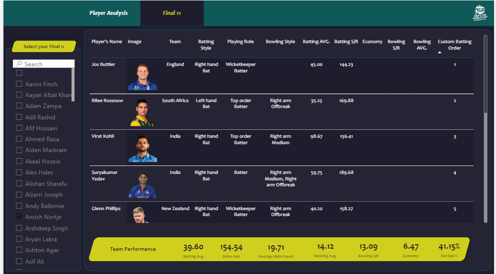

# 🏏 Cricket Best 11 – T20 World Cup Analytics Dashboard


---

# 📌 Project Overview

Cricket Best 11 is an interactive **Power BI analytics dashboard** built using player performance data from the **ICC Men's T20 World Cup**. The project analyzes players based on batting, bowling, and all-round abilities to help users create the strongest possible **Final Playing XI**.

The dashboard combines **Power BI**, **Power Query**, and **DAX** to transform raw cricket data into meaningful visual insights through interactive charts, KPIs, and player comparisons.

### The dashboard allows users to:

- Analyze players based on their roles
- Compare batting and bowling performances
- Explore player statistics across Qualifier and Super 12 stages
- Select the best Final Playing XI
- Visualize team performance using dynamic dashboards

---

# 🎯 Project Highlights

## Objective

- Analyze player performance during the ICC Men's T20 World Cup
- Compare batting and bowling statistics across player roles
- Build the optimal Final Playing XI
- Create an interactive dashboard for cricket analytics
- Support data-driven team selection

---

## Concepts & Techniques Used

- Data Cleaning using Power Query
- Data Modeling
- DAX Measures & Calculated Columns
- KPI Cards
- Scatter Plot Analysis
- Trend Analysis
- Interactive Filtering
- Role-Based Dashboard Design
- Data Visualization

---

## Tools & Technologies

- Microsoft Power BI Desktop
- Power Query
- DAX (Data Analysis Expressions)
- Microsoft Excel
- Data Visualization
- Cricket Analytics

---

# 📸 Dashboard Preview

## 🥊 Power Hitters / Openers


## ⭐ Final Playing XI Builder



---

# 🚀 Interactive Dashboard

The Power BI dashboard provides a highly interactive experience for exploring player performance and building an optimal cricket team.

Users can:

- Switch between different player roles
- Filter players using tournament stage
- Compare player performance instantly
- View batting and bowling KPIs
- Analyze scatter plots for player comparison
- Build their own Final Playing XI
- Monitor team-level statistics dynamically

The dashboard enables coaches, analysts, and cricket enthusiasts to make informed decisions using visual analytics.

---

# 📊 Dashboard Features

### 🥊 Power Hitters

- Strike Rate Analysis
- Boundary Percentage
- Batting Average
- Batting Position
- Scatter Plot Comparison

### 🎯 Anchors

- Consistent Run Scorers
- Batting Average
- Balls Faced
- Match Performance
- Player Comparison

### ⚡ Finishers

- Death Overs Specialists
- Strike Rate
- Boundary Percentage
- Runs Scored
- Performance Metrics

### 🏏 All Rounders

- Batting Contribution
- Bowling Contribution
- Economy Rate
- Bowling Strike Rate
- Combined Performance

### 💨 Fast Bowlers

- Economy Rate
- Bowling Average
- Dot Ball Percentage
- Wickets Taken
- Bowling Strike Rate

### ⭐ Final Playing XI

- Interactive Player Selection
- Dynamic Team Statistics
- Batting Summary
- Bowling Summary
- Overall Team Performance

---

# 📈 Key Metrics

| Metric | Description |
|---------|-------------|
| Batting Average | Average runs scored before dismissal |
| Strike Rate | Runs scored per 100 balls |
| Boundary % | Percentage of runs scored through boundaries |
| Economy Rate | Runs conceded per over |
| Bowling Average | Runs conceded per wicket |
| Bowling Strike Rate | Balls bowled per wicket |
| Dot Ball % | Percentage of dot deliveries |
| Wickets | Total wickets taken |

---

# 🗂 Repository Structure

```
📂 cricket-world-cup-analysis
│
├── 📁 t20_csv_files
├── 📁 t20_json_files
├── 📁 t20_data_preprocessing
├── 📁 web_scrapping_codes
│
├── 📄 Cricket-Best-11.pbix
├── 📄 DAX-Measures-and-Calculated-Columns.xlsx
│
├── 🖼 P1.png
├── 🖼 P2.png
├── 🖼 P3.png
├── 🖼 P4.png
├── 🖼 P5.png
├── 🖼 P6.png
│
└── 📄 README.md
```

---

# 🏆 Results

### Player Performance Analysis

- Analyzed batting and bowling performance for all participating players.
- Categorized players into specialized roles for easier comparison.

### Interactive Dashboard

- Built a fully interactive Power BI dashboard using filters, slicers, KPIs, and DAX.
- Enabled real-time player comparisons and team analysis.

### Final Playing XI Builder

- Developed an interactive system for selecting the strongest XI.
- Displayed combined batting and bowling statistics automatically.

### Data Visualization

- Created informative charts including:
  - Scatter Plots
  - KPI Cards
  - Trend Analysis
  - Player Comparison Charts
  - Performance Tables

---

# 🏏 Tournament Context

The project is based on player statistics from the **ICC Men's T20 World Cup**, including both the **Qualifier** and **Super 12** stages.

Performance metrics include batting, bowling, fielding, and overall contribution, allowing comprehensive player evaluation for building an optimal cricket team.

---

# 🛠 Built With

- Microsoft Power BI Desktop
- Power Query
- DAX (Data Analysis Expressions)
- Microsoft Excel
- Data Visualization
- Sports Analytics

---

# 🚀 Future Improvements

- Live Cricbuzz/ESPN Cricinfo API Integration
- Player Form Prediction using Machine Learning
- Team Win Probability Dashboard
- Venue-wise Performance Analysis
- Opposition-wise Player Comparison
- Fantasy Cricket Team Recommendation
- Power BI Service Deployment
- Mobile Responsive Dashboard

---

# 👨‍💻 Author

**Abhishek Rawat**

**Master's in Operational Research (Data Science)**

Passionate about **Sports Analytics**, **Data Visualization**, **Machine Learning**, and **Operations Research**.

⭐ If you found this project useful, consider giving it a **Star** on GitHub!
